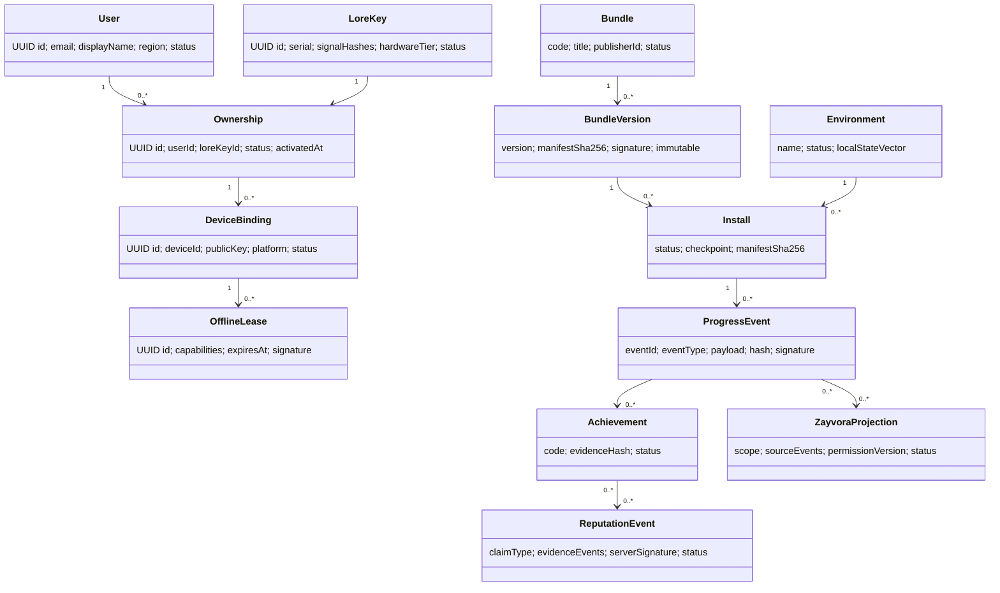
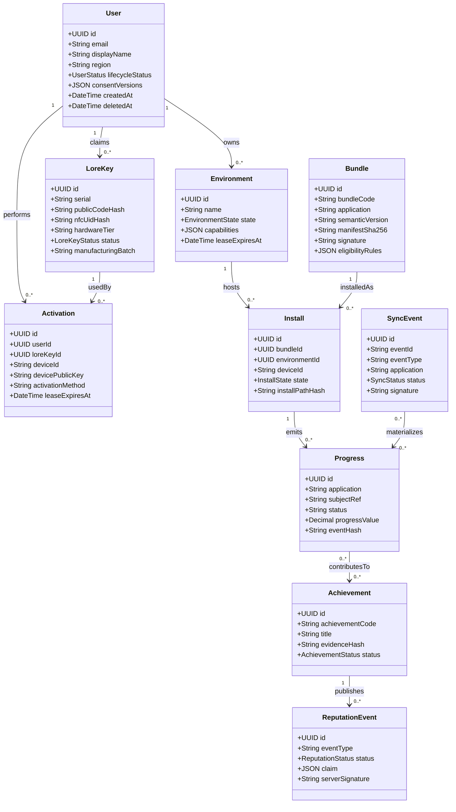

# 11 — Domain Model

## 1. Domain Rule

The Lore Key artifact is not an identity. It is a physical signal that Aporaksha validates during authenticated ownership activation.

## 2. UML-Style Model



## 3. Entities

### User

Purpose: authenticated learner or operator.

Attributes: `id`, `email`, `displayName`, `region`, `status`, `consentVersions`, `recoveryPublicKey`, timestamps, `deletedAt`.

Relationships: owns Ownership records; owns events, progress, achievements, reputation, and projections.

Lifecycle: `NEW -> ACTIVATED -> ENGAGED -> CONTRIBUTOR -> ALUMNI`; `SUSPENDED` restricts capabilities.

Validation: email or recovery key required; current consent required before activation; soft-deleted users cannot activate.

Constraints: user controls local history exports; server audit remains pseudonymized when required.

### LoreKey

Purpose: manufactured artifact record and physical signal reference.

Attributes: `id`, `serial`, `publicCodeHash`, `nfcUidHash`, `secureElementPublicKey`, `hardwareTier`, `manufacturingBatch`, `status`.

Relationships: has zero or one active Ownership.

Lifecycle: `REGISTERED -> UNCLAIMED -> OWNED -> ACTIVE -> SUSPENDED -> REVOKED`.

Validation: serial unique; raw activation codes never stored; secure element tier requires public key.

Constraints: QR/NFC/serial are signals only; revoked is terminal.

### Ownership

Purpose: binding between authenticated User and LoreKey.

Attributes: `id`, `userId`, `loreKeyId`, `status`, `activatedAt`, `reason`.

Relationships: one User, one LoreKey, many DeviceBindings.

Lifecycle: `PENDING -> ACTIVE -> SUSPENDED -> ACTIVE` or `REVOKED`.

Validation: one active ownership per key; activation requires Aporaksha validation.

Constraints: transfer requires admin or recovery workflow.

### DeviceBinding

Purpose: binds ownership to device public key.

Attributes: `id`, `deviceId`, `platform`, `publicKey`, `trustTier`, `status`, timestamps.

Relationships: belongs to Ownership; issues OfflineLeases.

Lifecycle: `REQUESTED -> ACTIVE -> SUSPENDED/REMOVED/LOST`.

Validation: public key required; signed assertions required; device limit enforced.

Constraints: device private key never leaves device.

### OfflineLease

Purpose: signed local authorization for offline runtime.

Attributes: `id`, `userId`, `ownershipId`, `deviceId`, `capabilities`, `issuedAt`, `expiresAt`, `signature`, `status`.

Relationships: belongs to DeviceBinding; referenced by events.

Lifecycle: `ACTIVE -> EXPIRED`, `ACTIVE -> SUPERSEDED`, `ACTIVE -> REVOKED`.

Validation: Aporaksha signature required; capability scope explicit.

Constraints: expired leases preserve local data but block protected features.

### Bundle

Purpose: product-level installable environment family.

Attributes: `bundleCode`, `title`, `primaryApplication`, `publisherId`, `eligibilityRules`, `status`.

Relationships: has BundleVersions.

Lifecycle: `DRAFT -> SIGNED -> PUBLISHED -> DEPRECATED/REVOKED`.

Validation: published versions must be immutable and signed.

Constraints: bundle content is never stored on LoreKey.

### BundleVersion

Purpose: immutable signed `.viabundle.json` release.

Attributes: `version`, `channel`, `manifestUrl`, `manifestSha256`, `signature`, `signingKeyId`, status.

Relationships: installed by Installs.

Lifecycle: `SIGNED -> PUBLISHED -> DEPRECATED/REVOKED`.

Validation: semver required; hash and signature required.

Constraints: a published version cannot be mutated; create a new version instead.

### Environment

Purpose: local runtime context for StudyOS, PrepOS, SkillHex, ViaDecide, or Zayvora.

Attributes: `name`, `status`, `capabilities`, `localStateVector`.

Relationships: has Installs and events.

Lifecycle: `LOCKED -> AUTHENTICATING -> INSTALLING -> ACTIVE -> OFFLINE -> EXPIRED`.

Validation: active environment requires verified install and valid lease.

Constraints: environment expiry never deletes user data.

### Install

Purpose: installation instance of BundleVersion into Environment.

Attributes: `id`, `status`, `manifestSha256`, `checkpoint`, `installPathHash`, `failureReason`.

Relationships: belongs to User, DeviceBinding, Environment, BundleVersion.

Lifecycle: `PLANNED -> DOWNLOADING -> VERIFYING -> INSTALLING -> CONFIGURING -> ACTIVE`; failure path `FAILED -> ROLLED_BACK`.

Validation: cannot become active without signature/hash verification.

Constraints: rollback preserves local user-created data.

### ProgressEvent

Purpose: canonical event proving learning activity.

Attributes: `eventId`, `eventType`, `application`, `aggregate`, `payload`, `eventHash`, `signature`, `leaseId`, `status`.

Relationships: materializes Progress and can contribute to Achievement.

Lifecycle: `LOCAL_CREATED -> QUEUED -> SUBMITTED -> ACCEPTED/REJECTED/CONFLICTED -> MATERIALIZED`.

Validation: schema, hash, signature, idempotency, lease window.

Constraints: progress is event-based; direct manual progress mutation is not authoritative.

### Achievement

Purpose: derived milestone from accepted events.

Attributes: `achievementCode`, `title`, `evidenceEventIds`, `evidenceHash`, `status`.

Relationships: may produce ReputationEvents.

Lifecycle: `PENDING -> AWARDED -> REVOKED/SUPERSEDED`.

Validation: evidence events must be accepted.

Constraints: achievements are private until reputation consent.

### ReputationEvent

Purpose: signed claim generated from verified evidence.

Attributes: `reputationEventId`, `claimType`, `claim`, `evidenceEventIds`, `serverSignature`, `status`, `consentVersion`.

Relationships: references Achievement and events.

Lifecycle: `DRAFT -> PENDING_VERIFICATION -> ACCEPTED/PUBLISHED` or `REJECTED/REVOKED`.

Validation: verified events and consent required.

Constraints: manual claims cannot become verified reputation.

### SyncEvent

Purpose: client queue item submitted for server reconciliation.

Attributes: `syncBatchId`, `eventId`, `status`, `attempts`, `conflictDetails`, `rejectionReason`.

Relationships: wraps ProgressEvent envelope.

Lifecycle: `PENDING -> PROCESSING -> ACCEPTED/REJECTED/CONFLICTED`.

Validation: stable IDs and idempotent server response.

Constraints: rejected events remain diagnosable.

### ZayvoraProjection

Purpose: permissioned memory/context projection.

Attributes: `projectionId`, `scope`, `sourceEventIds`, `permissionVersion`, `projectionPayload`, `status`.

Relationships: references User and source events.

Lifecycle: `REQUESTED -> CREATED -> INSPECTED -> CORRECTED/REVOKED`.

Validation: explicit permission and source events required.

Constraints: projection is scoped, inspectable, and revocable.
# Domain Model

## 1. Purpose

This document defines the canonical business domain model for Lore Key execution architecture. It resolves entity names, attributes, relationships, lifecycle states, validation rules, and business constraints so implementation agents can build services, storage, APIs, events, and tests from a common model.

## 2. Aggregate Overview

```text
+----------------+        owns/claims        +----------------+
| User           |-------------------------->| LoreKey        |
+----------------+                           +----------------+
        |                                             |
        | creates                                     | validates
        v                                             v
+----------------+       authorizes          +----------------+
| Activation     |-------------------------->| Environment    |
+----------------+                           +----------------+
        |                                             |
        | installs                                    | contains
        v                                             v
+----------------+       from version        +----------------+
| Install        |-------------------------->| Bundle         |
+----------------+                           +----------------+
        |
        | produces
        v
+----------------+       awards             +----------------+
| Progress       |-------------------------->| Achievement    |
+----------------+                           +----------------+
        |                                             |
        | queued as                                   | publishes
        v                                             v
+----------------+       verifies           +----------------+
| SyncEvent      |-------------------------->| ReputationEvent|
+----------------+                           +----------------+
```

## 3. UML-Style Class Diagram



## 4. Entity Definitions

### 4.1 User

#### Purpose

Represents a learner, administrator, mentor, verifier, or service actor. In MVP, the primary user is a learner who activates a Lore Key, installs environments, records progress, and publishes reputation events.

#### Attributes

| Attribute | Type | Required | Description |
|---|---|---:|---|
| `id` | UUID | Yes | Stable internal identifier. |
| `email` | Email | Conditionally | Login and recovery identifier; optional for offline/cohort users if recovery key exists. |
| `displayName` | String | Yes | Human-readable name. |
| `region` | ISO-like string | Yes | Used for eligibility, privacy, and localization policy. |
| `lifecycleStatus` | Enum | Yes | `NEW`, `ACTIVATED`, `ENGAGED`, `CONTRIBUTOR`, `ALUMNI`. |
| `consentVersions` | JSON array | Yes | Accepted terms, privacy, and reputation consent versions. |
| `recoveryPublicKey` | String | No | Public key used for privacy-preserving recovery. |
| `metadata` | JSON | Yes | Extensible non-critical attributes. |
| `createdAt` / `updatedAt` | DateTime | Yes | Audit timestamps. |
| `deletedAt` | DateTime | No | Soft deletion marker. |

#### Relationships

- One User can claim many LoreKeys over time.
- One User can create many Activations across devices.
- One User owns many Environments and Installs.
- One User produces Progress, Achievements, SyncEvents, and ReputationEvents.

#### Lifecycle

```text
NEW -> ACTIVATED -> ENGAGED -> CONTRIBUTOR -> ALUMNI
        ^                          |             |
        |                          +-------------+
        +------ reactivation from ALUMNI --------+
```

#### Validation Rules

- `email` must be normalized lowercase if present.
- User must have either `email` or `recoveryPublicKey`.
- Consent versions must include current terms and privacy versions before activation.
- Deactivated or soft-deleted users cannot create new activations.

#### Business Constraints

- User identity is not equivalent to a device; device binding is separate.
- User progress is learner-owned, but server-verified reputation may remain in audit records after soft deletion in pseudonymized form.
- Multiple users cannot actively share one LoreKey unless a defined family/classroom policy is introduced.

### 4.2 LoreKey

#### Purpose

Represents the physical artifact used to anchor identity, validate entitlement, and install environments. It is an installer key, not a content container.

#### Attributes

| Attribute | Type | Required | Description |
|---|---|---:|---|
| `id` | UUID | Yes | Internal key identifier. |
| `serial` | String | Yes | Human-readable printed serial. |
| `publicCodeHash` | String | Yes | Server-side hash of QR/public activation code. |
| `nfcUidHash` | String | No | Hash of NFC UID or NDEF identifier. |
| `secureElementPublicKey` | String | No | Secure challenge key for higher tiers. |
| `manufacturingBatch` | String | Yes | Batch traceability identifier. |
| `hardwareTier` | Enum/String | Yes | `QR`, `QR_NFC`, `SECURE_ELEMENT`, or future variant. |
| `status` | Enum | Yes | `UNCLAIMED`, `CLAIMED`, `ACTIVE`, `SUSPENDED`, `REVOKED`. |
| `claimedByUserId` | UUID | No | User who claimed the key. |
| `statusReason` | String | No | Required for suspension or revocation. |

#### Relationships

- Belongs to zero or one active User claimant.
- Has many Activation attempts and successful device bindings.
- Authorizes Bundle entitlement through eligibility rules.

#### Lifecycle

```text
UNCLAIMED -> CLAIMED -> ACTIVE -> SUSPENDED -> ACTIVE
      |          |          |          |
      +----------+----------+----------+-> REVOKED
```

#### Validation Rules

- `serial` is globally unique.
- `publicCodeHash` must never store raw activation code.
- `claimedByUserId` is null only while `UNCLAIMED`.
- `statusReason` is required for `SUSPENDED` or `REVOKED`.
- `SECURE_ELEMENT` tier requires `secureElementPublicKey`.

#### Business Constraints

- A key cannot be unrevoked after `REVOKED`; replacement creates a new key linked administratively.
- QR-only keys are low assurance and cannot issue high-stakes reputation by default.
- Key loss does not delete installed local state; it affects future validation and recovery.

### 4.3 Bundle

#### Purpose

Defines an installable, signed environment package or module set resolved by entitlement. A Bundle can install one or more applications and modules.

#### Attributes

| Attribute | Type | Required | Description |
|---|---|---:|---|
| `id` | UUID | Yes | Internal bundle identifier. |
| `bundleCode` | String | Yes | Stable business code such as `chemistry-foundations`. |
| `application` | String | Yes | Primary app: StudyOS, PrepOS, SkillHex, ViaDecide, Zayvora. |
| `title` | String | Yes | User-facing title. |
| `semanticVersion` | SemVer | Yes | Immutable version. |
| `channel` | String | Yes | `stable`, `beta`, `cohort`, `security`. |
| `manifestUrl` | URL | Yes | Location of `.viabundle` manifest. |
| `manifestSha256` | Hash | Yes | Manifest integrity. |
| `signature` | String | Yes | Publisher signature. |
| `eligibilityRules` | JSON | Yes | Cohort, region, key tier, or user constraints. |

#### Relationships

- One Bundle has many immutable versions.
- One Bundle version can be installed many times.
- Bundles depend on other Bundles or runtime Packages.
- Installs reference exactly one resolved Bundle version.

#### Lifecycle

```text
DRAFT -> SIGNED -> PUBLISHED -> DEPRECATED -> REVOKED
              |          |
              +----------+-> SUPERSEDED
```

#### Validation Rules

- Published bundle versions are immutable.
- Manifest hash and signature must verify before installation.
- Dependencies must be acyclic and version-resolvable.
- Revoked versions cannot be newly installed.

#### Business Constraints

- Bundle content must not be stored on the physical LoreKey.
- High-risk bundle updates require staged rollout and rollback plan.
- Local mirrors may cache only signed immutable artifacts.

### 4.4 Activation

#### Purpose

Records the act of claiming or validating a LoreKey against a user and device, producing tokens and offline leases.

#### Attributes

| Attribute | Type | Required | Description |
|---|---|---:|---|
| `id` | UUID | Yes | Activation record ID. |
| `userId` | UUID | Yes | Activating user. |
| `loreKeyId` | UUID | Yes | Physical key used. |
| `deviceId` | String | Yes | Bound device identifier. |
| `devicePlatform` | String | Yes | OS/runtime platform. |
| `devicePublicKey` | String | Yes | Public key for signed assertions. |
| `activationMethod` | Enum | Yes | `QR_SERIAL`, `NFC_UID`, `SECURE_CHALLENGE`, `RECOVERY`. |
| `activationNonceHash` | String | Yes | Anti-replay nonce hash. |
| `leaseExpiresAt` | DateTime | Yes | Initial offline lease expiry. |
| `idempotencyKey` | String | Yes | Retry-safe write key. |

#### Relationships

- Belongs to exactly one User and one LoreKey.
- Creates or updates one DeviceBinding conceptually.
- Authorizes one or more Environments to install.

#### Lifecycle

```text
REQUESTED -> VERIFIED -> DEVICE_BOUND -> LEASE_ISSUED -> COMPLETE
      |           |              |              |
      +-----------+--------------+--------------+-> FAILED
```

#### Validation Rules

- Nonce must be fresh and single-use.
- Device public key must be syntactically valid.
- Same `idempotencyKey` returns same result.
- Revoked keys cannot create successful activation.

#### Business Constraints

- Activation must be auditable even when it fails due to abuse signals.
- Activation cannot silently transfer an already claimed key.
- Device limits are enforced before lease issuance.

### 4.5 Install

#### Purpose

Represents a local installation instance of a Bundle version into an Environment on a device.

#### Attributes

| Attribute | Type | Required | Description |
|---|---|---:|---|
| `id` | UUID | Yes | Install ID. |
| `userId` | UUID | Yes | Owner. |
| `environmentId` | UUID | Yes | Target environment. |
| `bundleVersionId` | UUID | Yes | Resolved bundle version. |
| `deviceId` | String | Yes | Installing device. |
| `state` | Enum | Yes | `PLANNED`, `DOWNLOADING`, `VERIFYING`, `INSTALLING`, `CONFIGURING`, `ACTIVE`, `FAILED`, `ROLLED_BACK`. |
| `installPathHash` | String | No | Privacy-preserving local path reference. |
| `checkpoint` | JSON | Yes | Resumable phase state. |
| `installedAt` | DateTime | No | Completion timestamp. |

#### Relationships

- Belongs to User, Environment, Bundle version, and device.
- Produces Progress and SyncEvents once active.

#### Lifecycle

```text
PLANNED -> DOWNLOADING -> VERIFYING -> INSTALLING -> CONFIGURING -> ACTIVE
   |           |             |             |              |
   +-----------+-------------+-------------+--------------+-> FAILED -> ROLLED_BACK
```

#### Validation Rules

- Cannot enter `ACTIVE` unless all artifact hashes and signatures pass.
- Failed installs must preserve diagnostic logs and checkpoint state.
- Only one active install per `(user, device, environment, bundle major version)` unless side-by-side policy is enabled.

#### Business Constraints

- Rollback must never delete user-owned progress.
- Installer may remove cached artifacts but not audit records.
- Install state is local-first but syncable for support and entitlement.

### 4.6 Progress

#### Purpose

Represents materialized learning progress derived from signed local events.

#### Attributes

| Attribute | Type | Required | Description |
|---|---|---:|---|
| `id` | UUID | Yes | Progress record. |
| `userId` | UUID | Yes | Learner. |
| `application` | String | Yes | Source application. |
| `subjectRef` | String | Yes | Lesson, exam section, project, or skill node. |
| `progressType` | String | Yes | `lesson`, `attempt`, `project`, `skill`, `memory`. |
| `status` | String | Yes | Domain-specific status. |
| `progressValue` | Decimal | No | 0-1 completion or score. |
| `eventId` | String | Yes | Source event ID. |
| `eventHash` | String | Yes | Source payload hash. |
| `occurredAt` | DateTime | Yes | Local occurrence time. |

#### Relationships

- Belongs to User and optionally Install.
- May contribute to Achievements.
- Created from SyncEvents or direct online events.

#### Lifecycle

```text
RECORDED -> QUEUED -> ACCEPTED -> MATERIALIZED -> SUPERSEDED
                |          |
                +----------+-> REJECTED
```

#### Validation Rules

- `eventId` unique per user/application.
- Event hash must match canonical payload.
- Progress values must be within domain bounds.
- Server materialization must be idempotent.

#### Business Constraints

- Progress can be corrected through supersession, not silent mutation.
- Private progress is not public reputation until explicit consent.
- Offline progress may be useful locally before server acceptance but cannot support high-trust reputation until verified.

### 4.7 Achievement

#### Purpose

Represents a meaningful milestone derived from progress, project evidence, exam performance, or verified contribution.

#### Attributes

| Attribute | Type | Required | Description |
|---|---|---:|---|
| `id` | UUID | Yes | Achievement ID. |
| `userId` | UUID | Yes | Awarded learner. |
| `application` | String | Yes | Source application. |
| `achievementCode` | String | Yes | Stable business code. |
| `title` | String | Yes | User-facing label. |
| `description` | String | No | Explanation. |
| `evidenceHash` | String | Yes | Hash of evidence set. |
| `evidenceRefs` | JSON | Yes | Event IDs, artifact hashes, reviewer attestations. |
| `status` | Enum | Yes | `PENDING`, `AWARDED`, `REVOKED`, `SUPERSEDED`. |
| `awardedAt` | DateTime | No | Award timestamp. |

#### Relationships

- Belongs to User.
- Derived from many Progress records.
- May publish many ReputationEvents.

#### Lifecycle

```text
PENDING -> AWARDED -> SUPERSEDED
     |         |
     +---------+-> REVOKED
```

#### Validation Rules

- Evidence set must be complete and deterministic.
- Duplicate `achievementCode` per user/application is not allowed unless versioned.
- Revocation requires reason and actor.

#### Business Constraints

- Achievements are private by default.
- Awarded achievements can be revoked but should not be physically deleted from audit history.
- High-value achievements require stronger key tier or reviewer attestation.

### 4.8 ReputationEvent

#### Purpose

Represents a consented, signed, externally verifiable claim derived from achievements, progress signals, or portfolio artifacts.

#### Attributes

| Attribute | Type | Required | Description |
|---|---|---:|---|
| `id` | UUID | Yes | Reputation event ID. |
| `userId` | UUID | Yes | Claim owner. |
| `achievementId` | UUID | No | Source achievement. |
| `eventType` | String | Yes | `BADGE_EARNED`, `PROJECT_COMPLETED`, `TRUST_SCORE_UPDATED`, etc. |
| `status` | Enum | Yes | `PENDING`, `ACCEPTED`, `REJECTED`, `REVOKED`. |
| `claim` | JSON | Yes | Public/private claim payload. |
| `evidenceRefs` | JSON | Yes | Minimal references used for verification. |
| `localSignature` | String | Yes | Device/user signature. |
| `serverSignature` | String | No | Reputation service signature. |
| `publishedUrl` | URL | No | Optional public verification URL. |

#### Relationships

- Belongs to User.
- Often references Achievement.
- May include portfolio artifacts and reviewer attestations.

#### Lifecycle

```text
DRAFT -> CONSENTED -> PENDING_VERIFICATION -> ACCEPTED -> PUBLISHED
   |           |              |                 |
   +-----------+--------------+-----------------+-> REJECTED
                                      |
                                      +-> REVOKED
```

#### Validation Rules

- Consent record must exist before submission.
- Evidence must resolve to accepted Progress or Achievement records.
- Server signature is only added after verification.
- Replayed events are deduplicated by idempotency key.

#### Business Constraints

- Reputation is never published automatically without user consent.
- Public claims must not include private notes or raw exam data unless selected.
- Trust score changes must be explainable and auditable.

### 4.9 SyncEvent

#### Purpose

Represents an offline or online event submitted for reconciliation into server-side state.

#### Attributes

| Attribute | Type | Required | Description |
|---|---|---:|---|
| `id` | UUID | Yes | Internal sync row ID. |
| `eventId` | String | Yes | Client-generated deterministic event ID. |
| `userId` | UUID | Yes | Learner. |
| `deviceId` | String | Yes | Source device. |
| `application` | String | Yes | Source app. |
| `eventType` | String | Yes | Canonical event type. |
| `payload` | JSON | Yes | Canonical payload. |
| `eventHash` | String | Yes | Hash of canonical event. |
| `signature` | String | Yes | Device key signature. |
| `status` | Enum | Yes | `PENDING`, `PROCESSING`, `ACCEPTED`, `REJECTED`, `CONFLICTED`. |
| `attempts` | Integer | Yes | Retry counter. |

#### Relationships

- Belongs to User and device.
- Materializes into Progress, Achievement, Environment, or Reputation state depending on type.

#### Lifecycle

```text
PENDING -> PROCESSING -> ACCEPTED
   |           |            |
   |           +------------+-> CONFLICTED -> ACCEPTED
   +------------------------+-> REJECTED
```

#### Validation Rules

- Event hash must match canonical payload serialization.
- Signature must validate against active device binding.
- Event time must be plausible within offline lease windows.
- Duplicate events are idempotent.

#### Business Constraints

- Rejected events remain visible for diagnostics.
- Conflicted events require deterministic resolver or explicit user action.
- Sync ingestion must tolerate out-of-order arrival where dependencies are present.

### 4.10 Environment

#### Purpose

Represents a local-first application runtime context such as StudyOS, PrepOS, SkillHex, ViaDecide, or Zayvora.

#### Attributes

| Attribute | Type | Required | Description |
|---|---|---:|---|
| `id` | UUID | Yes | Environment ID. |
| `userId` | UUID | Yes | Owner. |
| `name` | String | Yes | Environment name. |
| `state` | Enum | Yes | `LOCKED`, `AUTHENTICATING`, `INSTALLING`, `ACTIVE`, `OFFLINE`, `EXPIRED`, `RECOVERY`. |
| `capabilities` | JSON | Yes | Enabled features. |
| `leaseExpiresAt` | DateTime | No | Offline authorization expiry. |
| `localStateVector` | JSON | Yes | Per-app sync counters. |
| `lastOpenedAt` | DateTime | No | Runtime telemetry. |

#### Relationships

- Belongs to User and device scope.
- Hosts Installs.
- Receives Bundle modules.
- Emits Progress and SyncEvents.

#### Lifecycle

```text
LOCKED -> AUTHENTICATING -> INSTALLING -> ACTIVE -> OFFLINE -> EXPIRED
   ^             |              |          |        |           |
   +-------------+--------------+----------+--------+-----------+
                  recovery/tamper/revocation -> LOCKED or RECOVERY
```

#### Validation Rules

- Environment cannot be `ACTIVE` without a valid Install.
- `OFFLINE` requires unexpired lease.
- `EXPIRED` must preserve user data and block protected features.
- `RECOVERY` must disable reputation publishing until state is validated.

#### Business Constraints

- Environment state is independent from a specific app UI process.
- An environment may contain multiple modules from multiple bundles only if dependency rules allow it.
- Local data must survive application upgrades and rollbacks.
