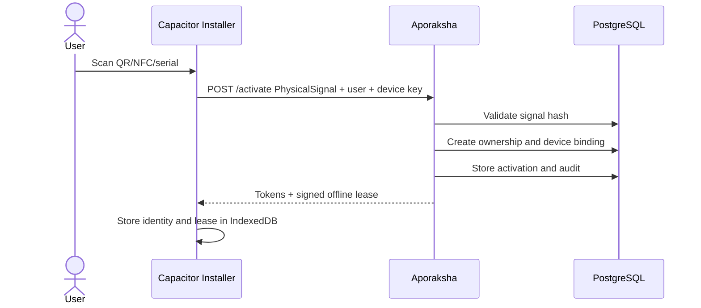
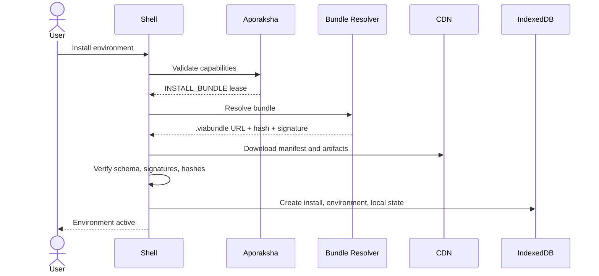
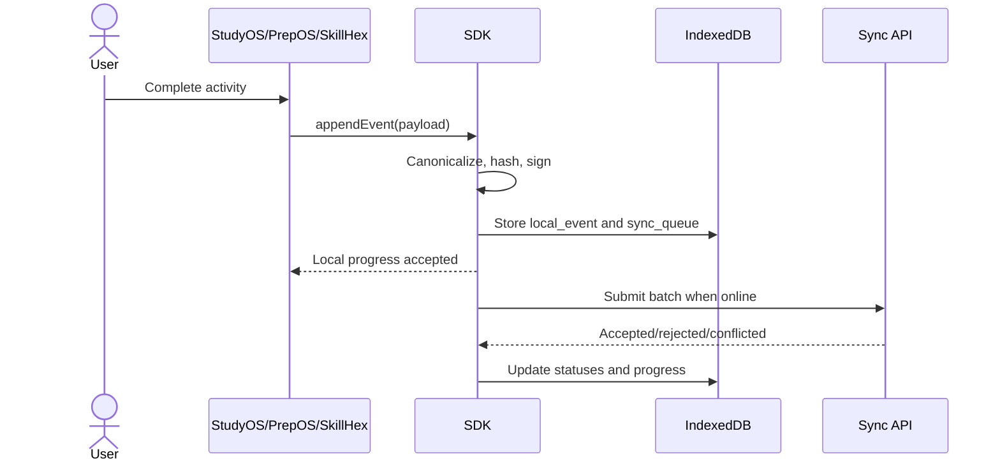
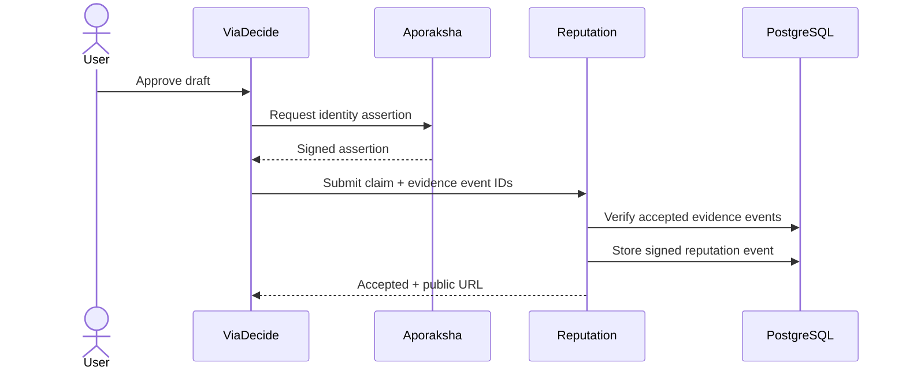
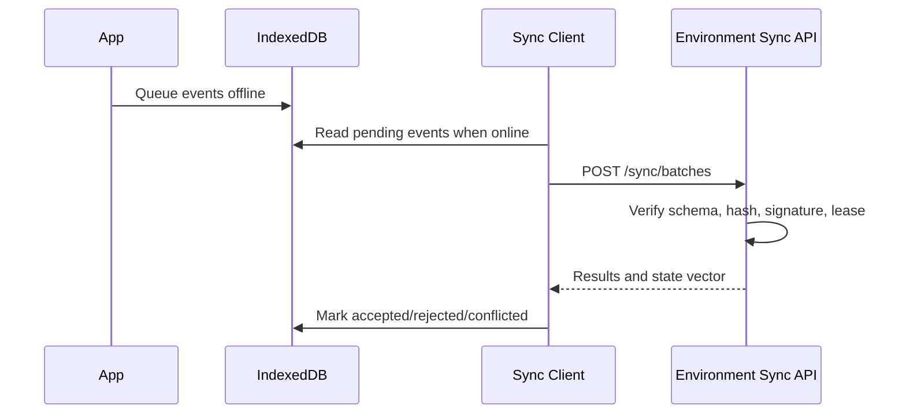
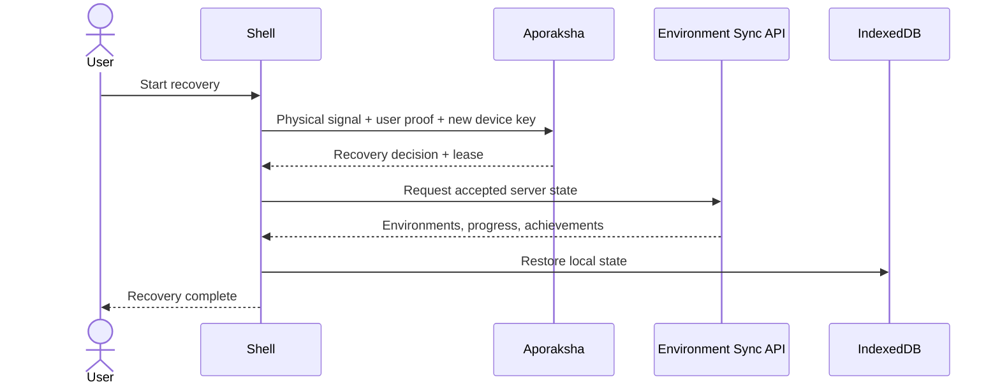
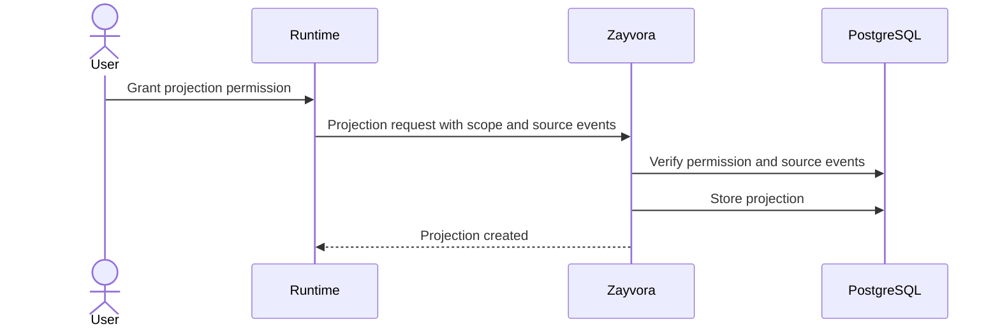

# 19 — System Sequence Diagrams

## 1. Activation

```mermaid
sequenceDiagram
  actor User
  participant Shell as Capacitor Installer
  participant Aporaksha
  participant DB as PostgreSQL
  User->>Shell: Scan QR/NFC/serial
  Shell->>Aporaksha: POST /activate PhysicalSignal + user + device key
  Aporaksha->>DB: Validate signal hash
  Aporaksha->>DB: Create ownership and device binding
  Aporaksha->>DB: Store activation and audit
  Aporaksha-->>Shell: Tokens + signed offline lease
  Shell->>Shell: Store identity and lease in IndexedDB
```

## 2. Installation

```mermaid
sequenceDiagram
  actor User
  participant Shell
  participant Aporaksha
  participant Resolver as Bundle Resolver
  participant CDN
  participant IDB as IndexedDB
  User->>Shell: Install environment
  Shell->>Aporaksha: Validate capabilities
  Aporaksha-->>Shell: INSTALL_BUNDLE lease
  Shell->>Resolver: Resolve bundle
  Resolver-->>Shell: .viabundle URL + hash + signature
  Shell->>CDN: Download manifest and artifacts
  Shell->>Shell: Verify schema, signatures, hashes
  Shell->>IDB: Create install, environment, local state
  Shell-->>User: Environment active
```

## 3. Progress Tracking

```mermaid
sequenceDiagram
  actor User
  participant App as StudyOS/PrepOS/SkillHex
  participant SDK
  participant IDB as IndexedDB
  participant Sync as Sync API
  User->>App: Complete activity
  App->>SDK: appendEvent(payload)
  SDK->>SDK: Canonicalize, hash, sign
  SDK->>IDB: Store local_event and sync_queue
  SDK-->>App: Local progress accepted
  SDK->>Sync: Submit batch when online
  Sync-->>SDK: Accepted/rejected/conflicted
  SDK->>IDB: Update statuses and progress
```

## 4. Reputation Publishing

```mermaid
sequenceDiagram
  actor User
  participant ViaDecide
  participant Aporaksha
  participant Reputation
  participant DB as PostgreSQL
  User->>ViaDecide: Approve draft
  ViaDecide->>Aporaksha: Request identity assertion
  Aporaksha-->>ViaDecide: Signed assertion
  ViaDecide->>Reputation: Submit claim + evidence event IDs
  Reputation->>DB: Verify accepted evidence events
  Reputation->>DB: Store signed reputation event
  Reputation-->>ViaDecide: Accepted + public URL
```

## 5. Offline Sync

```mermaid
sequenceDiagram
  participant App
  participant IDB as IndexedDB
  participant Client as Sync Client
  participant Server as Environment Sync API
  App->>IDB: Queue events offline
  Client->>IDB: Read pending events when online
  Client->>Server: POST /sync/batches
  Server->>Server: Verify schema, hash, signature, lease
  Server-->>Client: Results and state vector
  Client->>IDB: Mark accepted/rejected/conflicted
```

## 6. Recovery

```mermaid
sequenceDiagram
  actor User
  participant Shell
  participant Aporaksha
  participant Sync as Environment Sync API
  participant IDB as IndexedDB
  User->>Shell: Start recovery
  Shell->>Aporaksha: Physical signal + user proof + new device key
  Aporaksha-->>Shell: Recovery decision + lease
  Shell->>Sync: Request accepted server state
  Sync-->>Shell: Environments, progress, achievements
  Shell->>IDB: Restore local state
  Shell-->>User: Recovery complete
```

## 7. Zayvora Projection

```mermaid
sequenceDiagram
  actor User
  participant Runtime
  participant Zayvora
  participant DB as PostgreSQL
  User->>Runtime: Grant projection permission
  Runtime->>Zayvora: Projection request with scope and source events
  Zayvora->>DB: Verify permission and source events
  Zayvora->>DB: Store projection
  Zayvora-->>Runtime: Projection created
```
